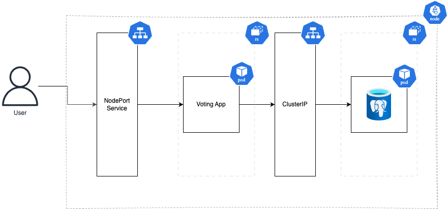

# Example Voting App

## Manual Docker Image Build & Push

*Login on Docker*

```
docker login
```

*Creating Image*

```
docker build -t example-voting-app .                                            
```         

*Tagging Image*

```
docker tag example-voting-app <your-docker-username>/example-voting-app:latest
```

*Pushing Image*

```
docker push <your-docker-username>/example-voting-app:latest                        
```

# Running app locally

To run the app locally, first run Minikube:

```
minikube start
```

Then create all vote resources needed:

```
kubectl apply -f k8s/vote/
```

## Populating database

After postgres pod is running, run the following command to populate the database:

```
kubectl exec -it <pod db name> -- psql -U postgres
```

access votedb

```
\c votedb
```

populate table

```
INSERT INTO votes
(id, quantity, "name")
VALUES(1, 0, 'cat');

INSERT INTO votes
(id, quantity, "name")
VALUES(2, 0, 'dog');
```

## Files

**vote-deployment** : Deployment of the vote app with pod configuration 

**vote-service** : NodePort service to connect to the app outside of the cluster.

**vote-database** : Postgres Database of App

**vote-service** : ClusterIP to connect vote pod with database

## Utilities Commands

Get all pods

```
kubectl get pods
```

Describe cluster services (showing the IP of the services)

```
kubectl describe services
```

Get the URL of the vote service (call access the app outside of cluster)

```
 minikube service vote
```

Get the logs of a pod

```
kubectl logs pod-name
```

## Architecture Draw

<p align="left">
    
</p>

# Requirements

- [Docker](https://www.docker.com/)
- [Minikube](https://minikube.sigs.k8s.io/docs/)
